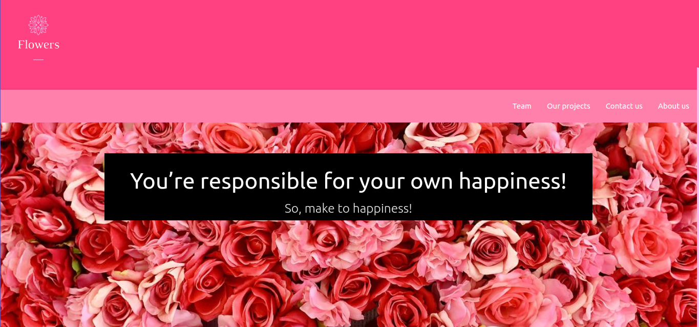

<h1 align="center">FLOWERS</h1>

Criar uma aplicação clone de um template disponível do Materialize, com intuito de promover o aprendizado utilizando o framework Front-End Materialize 

<h4 align="center"> 
	🚧  Status 🚀 Refatorando o código  🚧
</h4>

<h1 align="center">
  
</h1>

Este repositório tem foco, na criação de um template com o tema sobre flores para o ínicio do do aprendizado no framework Front-End Materialize.

Este projeto faz parte do meu portfólio pessoal, então, ficarei feliz caso você forneça algum feedback, código, estrutura, funcionalidade ou qualquer melhoria que você possa relatar para melhora-lo.Você pode usar este projeto como quiser, seja para estudar, fazer melhorias, você quem manda!.

<blockquote>
Este é um projeto totalmente grátis!
</blockquote>

### 🛠 Tecnologias

As seguintes ferramentas foram usadas na construção do template:

- [Materialize](https://materializecss.com/)

### Autor
---

 
 <b>Camila Adriana</b></a>  
Feito com ❤️ por Camila Adriana 👋🏽 Entre em contato!

  
